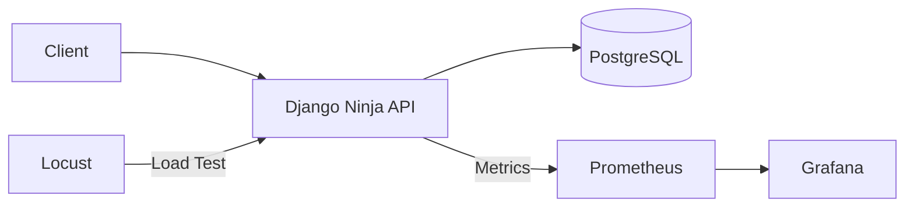

# E-commerce API – Clean Architecture & DDD

## 🚀 Overview
This project demonstrates a scalable REST API built with Django Ninja,
designed using Clean Architecture and Domain-Driven Design principles.

The main goal is to ensure data consistency under concurrent requests,
preventing stock overselling through transactional control and locking strategies.

---

## 🏗 Architecture

- Clean Architecture (Entities, Use Cases, Repositories, API layer)
- Domain-Driven Design principles
- Separation of concerns between business rules and framework



---

## 🔒 Concurrency Control

To prevent stock overselling, the system uses:

- Database-level locking
- Transaction management
- Concurrency tests simulating parallel purchase attempts

A stress test using threaded requests validates that stock is never reduced below zero.

---

## 🧪 Testing Strategy

- Unit tests for business rules
- Repository tests
- End-to-end tests
- Concurrency stress test

Run tests with:

```bash
make test