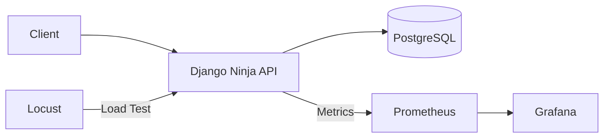
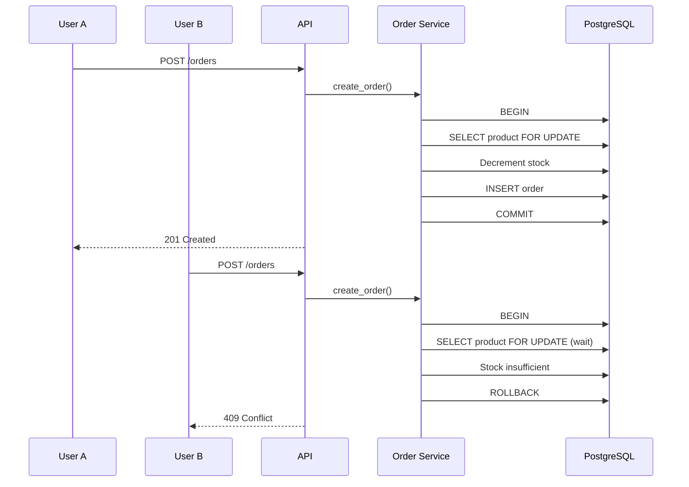

# E-commerce API – Clean Architecture & DDD

## 🚀 Overview

This project demonstrates a scalable REST API built with Django Ninja,
designed using Clean Architecture and Domain-Driven Design principles.

The main goal is to ensure data consistency under concurrent requests,
preventing stock overselling through transactional control and database row-level locking (`select_for_update`).

---

## 🏗 Architecture

- Clean Architecture (Entities, Use Cases, Repositories, API layer)
- Domain-driven separation of business rules and framework
- Transaction management for critical operations
- Observability with Prometheus & Grafana



## 🔒 Concurrency Strategy

To prevent stock overselling under concurrent purchase attempts, the system uses:

 - transaction.atomic
 - select_for_update for row-level locking
 - ACID guarantees from PostgreSQL
 - Proper HTTP conflict response (409 Conflict)



## 🧪 Testing

- Unit tests for domain logic
- Repository tests
- End-to-end API tests
- Concurrency stress test using parallel requests

Run tests:
```bash
pytest
```

## 📊 Observability

- Prometheus metrics endpoint
- HTTP latency and error metrics
- Domain-level metrics
- Grafana dashboards

```bash
docker-compose up --build
```

## ⚖️ Trade-offs & Improvements

- Distributed tracing could be added (OpenTelemetry)
- Authentication could be externalized
- Rate limiting could be introduced
- Horizontal scaling scenarios can be further explored